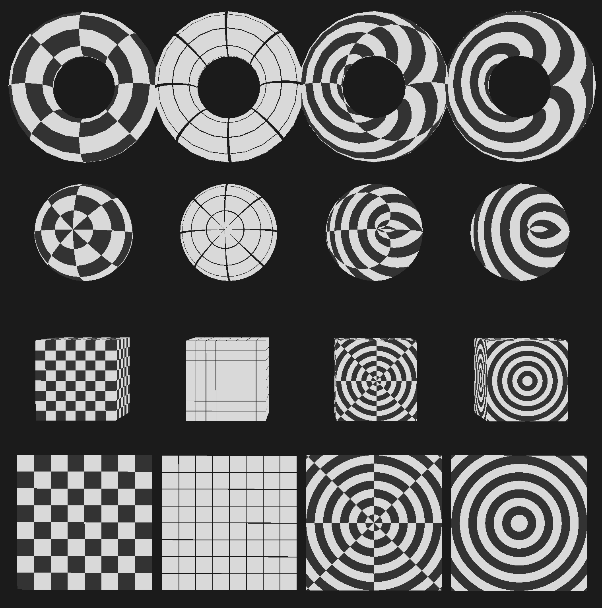
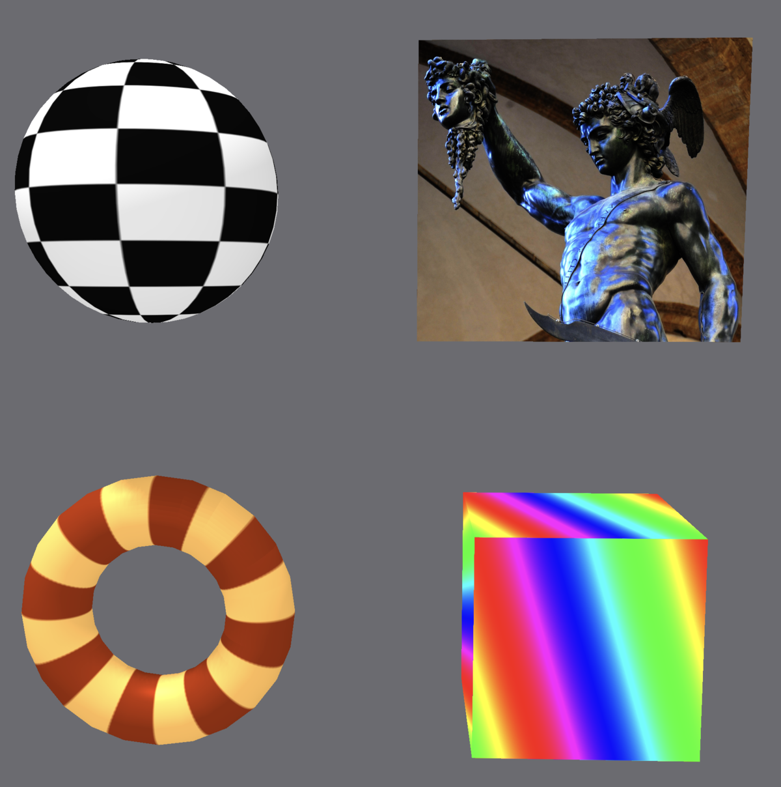
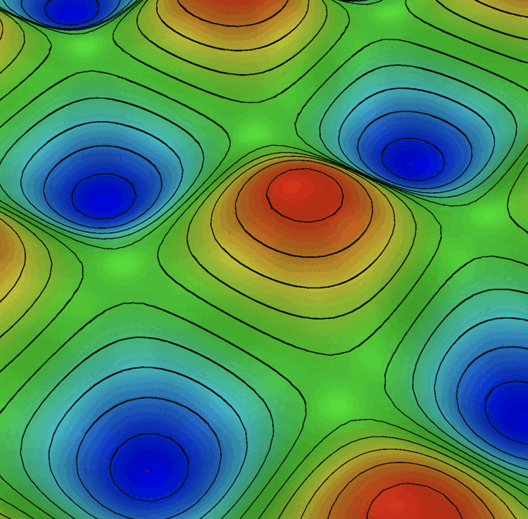

# viewport-lib

`viewport-lib` is a gpu-accelerated 3D viewport library for rust. It works with any GUI framework that gives you access to a wgpu device, queue, and render target: `eframe`/`egui`, `winit`, `Iced`, `Slint`, and others.

<table>
  <tr>
    <td></td>
    <td></td>
  </tr>
  <tr>
    <td></td>
    <td></td>
  </tr>
  <tr>
    <td></td>
    <td></td>
  </tr>
</table>

`viewport-lib` covers rendering, cameras, and post-processing. Your application owns the window, event loop, and tool state.


**WARNING**: The viewport has only recently been extracted as a stand-alone library from a separate project and the API is still somewhat unstable. When things become more solid I will release v1.0.0

## Core features

- **Geometry**: mesh, point cloud, polyline, volume, glyph, and streamtube rendering
- **Lighting**: directional, point, and spot lights; shadow maps;
- **Materials**: PBR and Blinn-Phong shading, normal maps, transparency
- **Scene tools**: clip planes, section views, scalar colouring, and colourmaps
- **Camera**: arcball orbit, orthographic projection, view presets, smooth animation, and frame-to-selection
- **Interaction**: CPU/GPU picking, rectangle selection, transform gizmos, and snapping
- **Overlays**: labels, scalar bar, rulers, and axes indicator


## Examples

The `examples/` directory contains working integrations for several GUI frameworks.

- **eframe-showcase**: run this first: demonstrates many of the viewport's built-in capabilities across multiple showcases (not exhaustive).
- **eframe-minimal**: the simplest integration: start here if you want to understand the minimal setup.
- **eframe-primitives**: demonstrates the built-in geometry primitives.
- **eframe-viewport**: a mid-complexity example with scene graph, picking, and gizmos.
- **eframe-input-controllers**: shows custom input bindings and controller configuration.

Other examples: `winit-viewport`, `winit-showcase`, `winit-primitives`, `winit-multi-viewport`, `iced-viewport`, `slint-viewport`, `gtk4-viewport`

Run examples with:
```
cargo run --release --example eframe-showcase
```

## Quick start

In a typical app you will need to use both the renderer (to build and submit a `FrameData`) and the input handler to define and handle keys and events.

### Rendering
```rust
use glam::{Mat4, vec3};
use viewport_lib::{
    Camera,
    CameraFrame,
    FrameData,
    SceneFrame,
    SceneRenderItem,
    primitives,
};

// Upload the cube primitive mesh once at startup
let mesh_index = renderer.resources_mut().upload_mesh_data(&device, &primitives::cube(1.0))?;

// Build a frame each render tick
let camera = Camera::default();
let model = glam::Mat4::from_translation(glam::vec3(1.0, 2.0, 0.0));
let item = SceneRenderItem {
    mesh_index,
    model: model.to_cols_array_2d(),
    ..SceneRenderItem::default()
};

let fd = FrameData::new(
    CameraFrame::from_camera(&camera, [width, height]),
    SceneFrame::from_surface_items(vec![item]),
);

renderer.prepare(&device, &queue, &fd);
// then call the renderer -- this will depend on what GUI you are using
// renderer.paint_to(&mut render_pass, &fd);

```

### Input handling

`OrbitCameraController` is one of the available built-in controllers. You can also build your own controller directly on top of `ViewportInput` and `ViewportBinding` if you need different navigation behaviour - but OrbitCameraController is a good starting point. Push events each frame, then call `apply_to_camera` to orbit/pan/zoom and get back an `ActionFrame` for the rest of your input logic.

```rust
use viewport_lib::{BindingPreset, ManipulationContext, ManipulationController, ManipResult, OrbitCameraController, ViewportContext, ViewportEvent};

// --- app state ---
let mut orbit = OrbitCameraController::new(BindingPreset::ViewportAll);
let mut manip = ManipulationController::new();

// prime the controller before the first frame
orbit.begin_frame(ViewportContext { hovered: true, focused: true, viewport_size: [width, height] });

// --- each frame ---

// 1. drive camera navigation; get the action frame for this frame
let frame = if manip.is_active() {
    // suppress orbit while a manipulation is in progress
    orbit.resolve()
} else {
    orbit.apply_to_camera(&mut camera)
};

// 2. drive the manipulation controller
let ctx = ManipulationContext {
    camera: camera.clone(),
    viewport_size: glam::Vec2::new(width, height),
    cursor_viewport: Some(cursor_pos),
    pointer_delta,
    selection_center: selected_object_center,
    gizmo: None,
    drag_started,
    dragging,
    clicked,
};

match manip.update(&frame, ctx) {
    ManipResult::Update(delta) => {
        // apply incremental transform to selected objects each frame
        object_translation += delta.translation;
        object_rotation    = delta.rotation * object_rotation;
        object_scale       *= delta.scale;
    }
    ManipResult::ConstraintChanged => {
        // axis constraint changed mid-session: restore objects to their
        // pre-session transforms (same as cancel but keep the session alive)
        restore_snapshot();
    }
    ManipResult::Commit => finalize_and_push_undo(),
    ManipResult::Cancel => restore_snapshot(),
    ManipResult::None   => {}
}

// 3. reset for next frame
orbit.begin_frame(ViewportContext { hovered, focused, viewport_size: [width, height] });
```

## License

This project is licensed under the GNU General Public License v3.0. See [LICENSE](LICENSE) for details. Get in contact for details on purchasing a commercial license.
