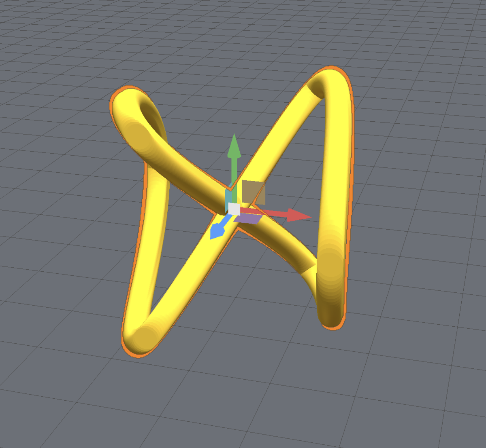
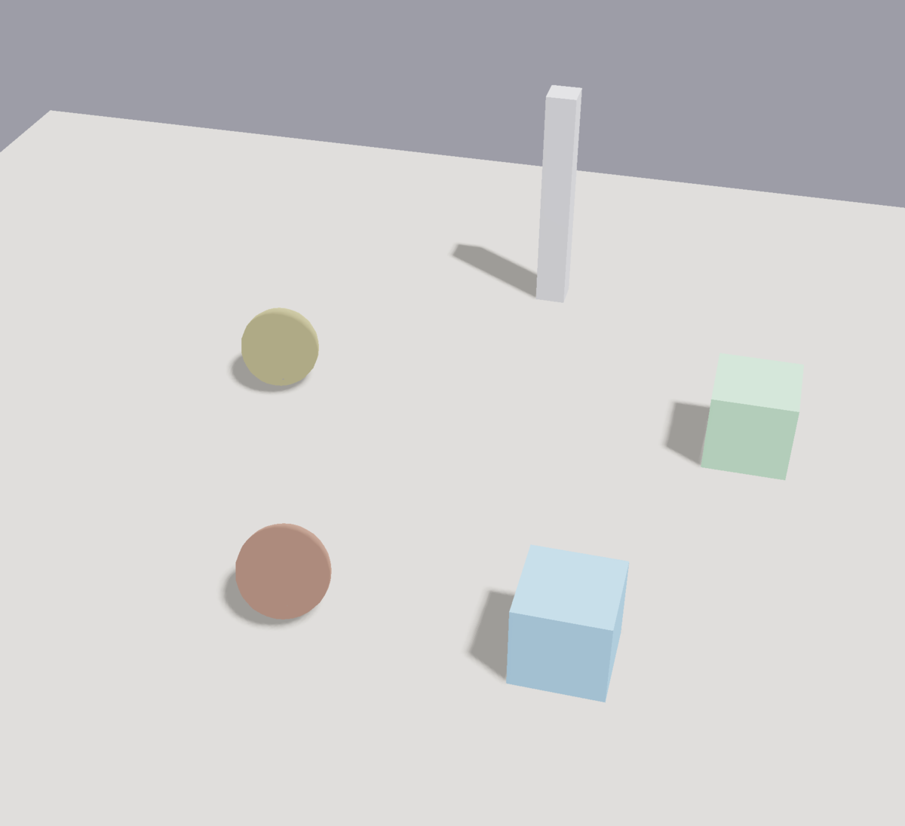
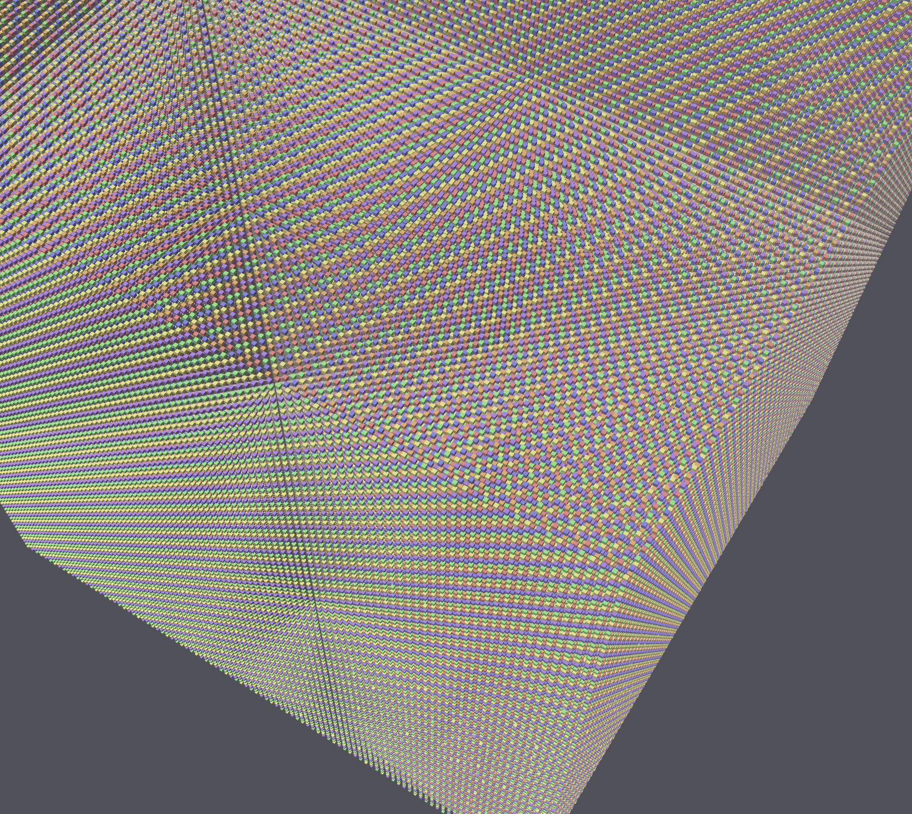
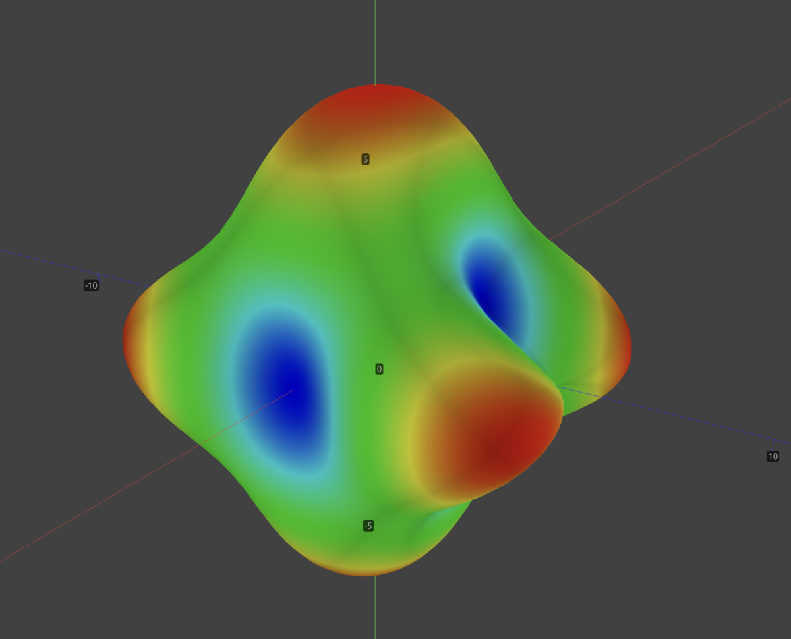

# viewport-lib

`viewport-lib` is a gpu-accelerated 3D viewport library for rust. The library gives you a renderer, camera, picking-tools, light sources, gizmos and scene primitives.

<table>
  <tr>
    <td></td>
    <td></td>
  </tr>
  <tr>
    <td></td>
    <td></td>
  </tr>
</table>

Whichever gui library you choose to use (`winit`, `eframe`, `Iced`, `Slint`, etc.), the integration model stays the same in each case:
- `viewport-lib` owns rendering and viewport-side maths;
- your application owns the window, event loop, and tool state;


**WARNING**: `viewport-lib` has only recently been extracted as a stand-alone library from a separate project and the API is still somewhat unstable.

## Core features
- mesh, point cloud, polyline, and volume rendering
- directional lighting, shadow mapping, and post-processing
- material shading, normal maps, transparency, outlines, and x-ray views
- clip planes, section views, scalar coloring, and colormaps
- arcball camera, view presets, framing, and smooth camera animation
- CPU/GPU picking, rectangle selection, transform gizmos, and snapping
- annotations, axes indicators


## Examples

The `examples/` directory contains working integrations for several GUI frameworks.

- **winit-viewport**: the most basic setup: raw `winit` + `wgpu` with no GUI framework. Start here if you want to understand the minimal integration.
- **eframe-viewport**: a straightforward example of embedding the viewport inside an `egui`/`eframe` application using `egui_wgpu` callback resources.
- **winit-showcase**: several more advanced rendering options in 9 showcases

Other examples:
- `iced-viewport`, `slint-viewport`, `winit-showcase`, `gtk4-viewport`

Run examples with:
```
cargo run --release --example winit-viewport
```