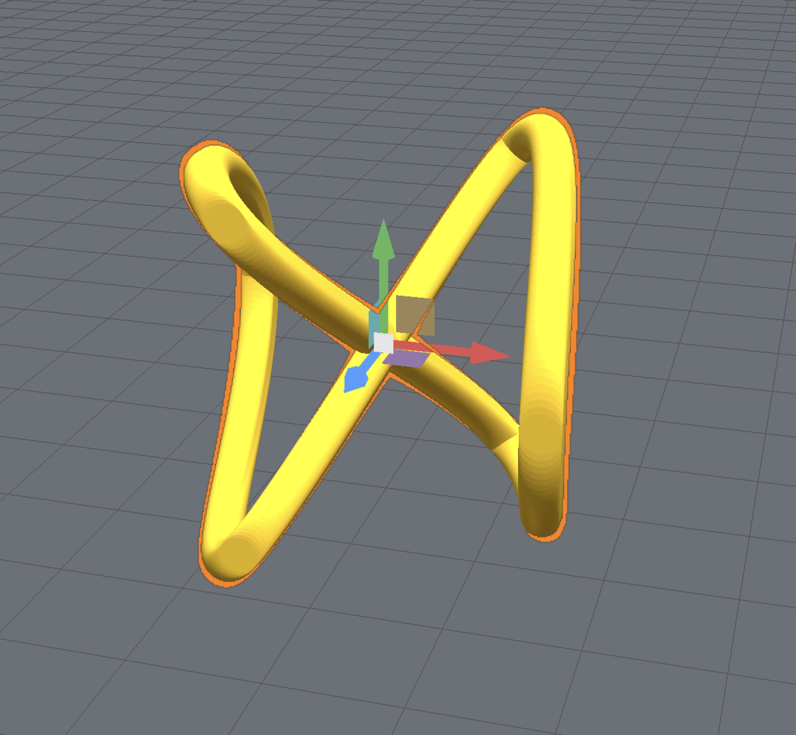
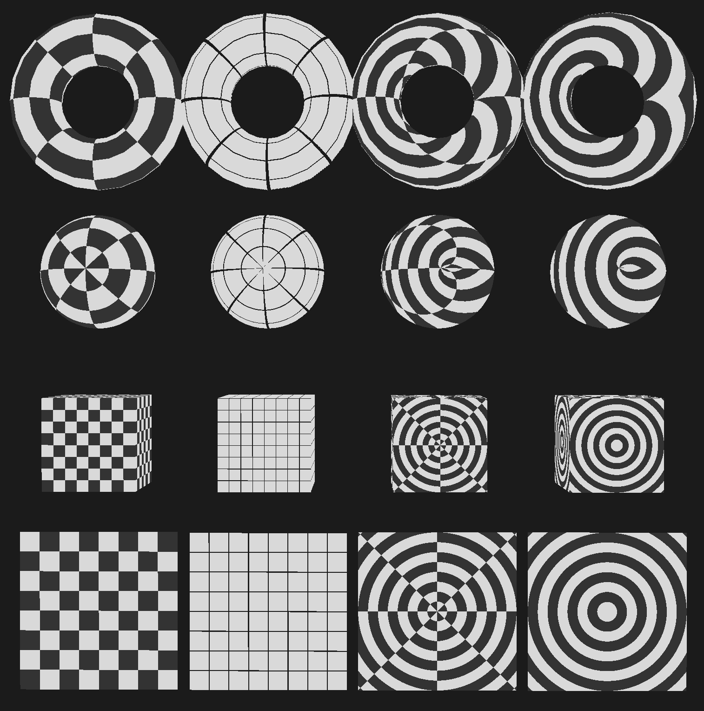
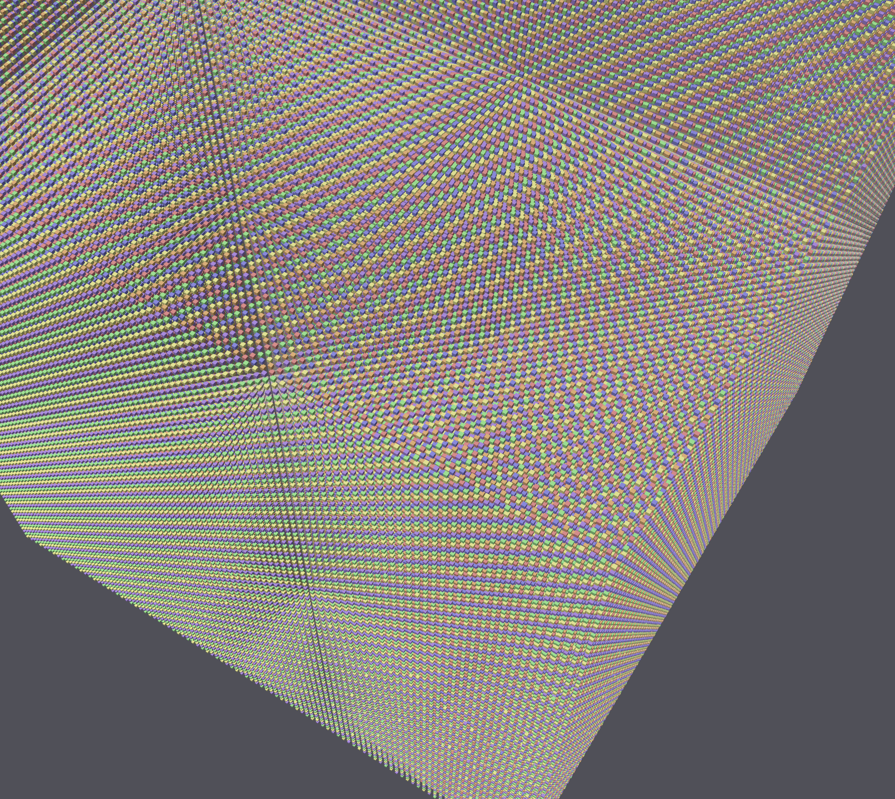
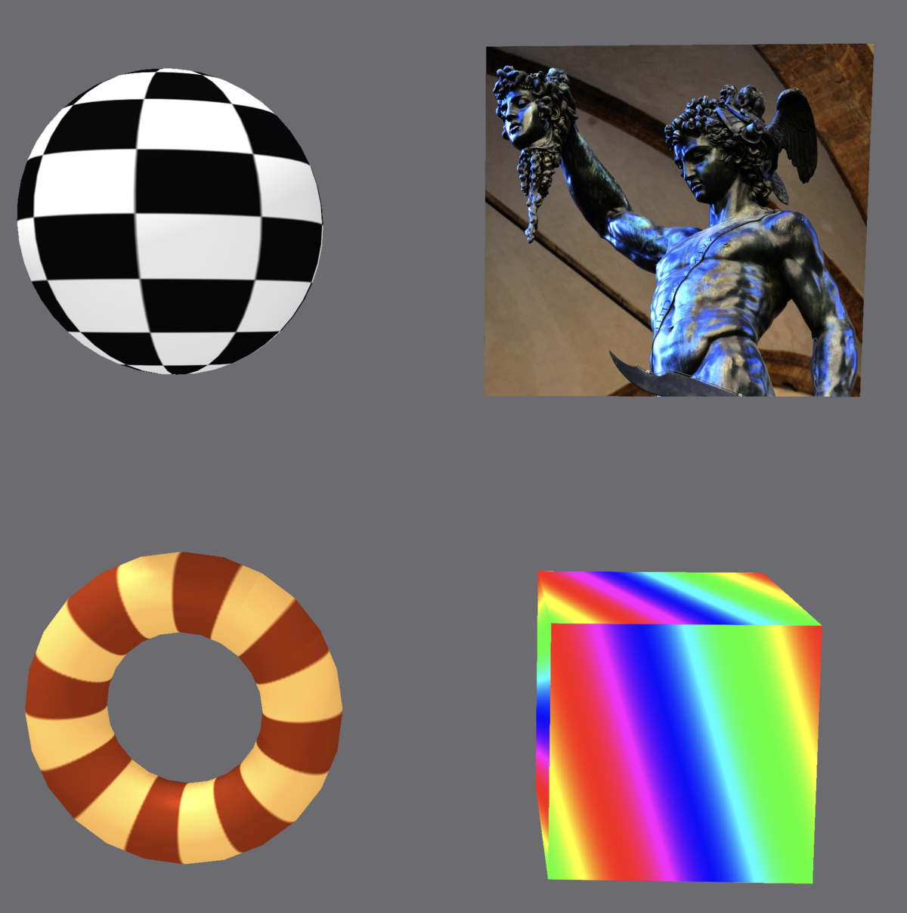
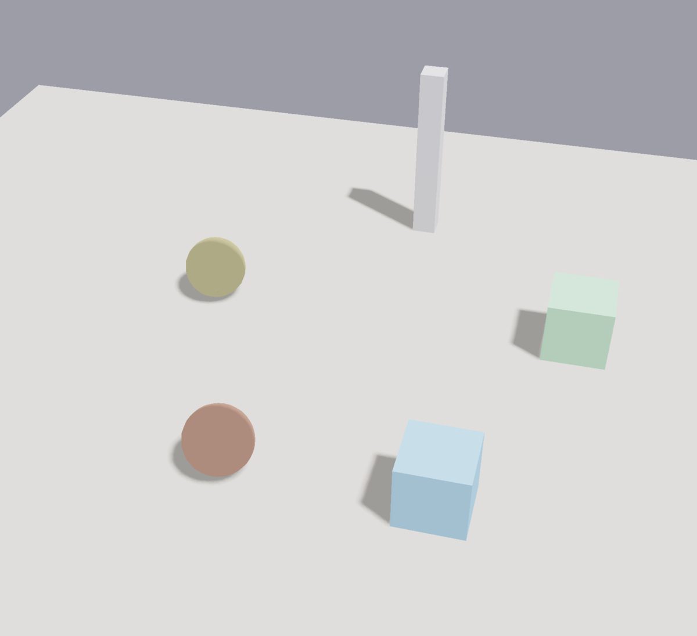
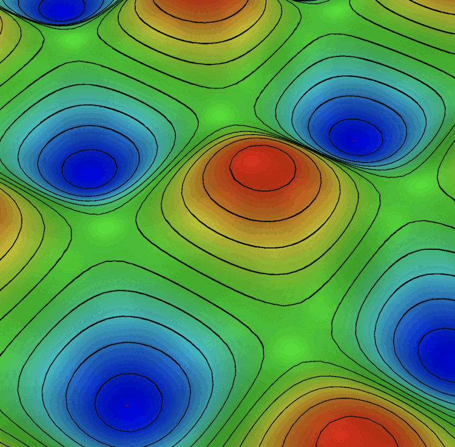

# viewport-lib

`viewport-lib` is a gpu-accelerated 3D viewport library for rust. It works with any GUI framework that gives you access to a wgpu device, queue, and render target: `eframe`/`egui`, `winit`, `Iced`, `Slint`, and others.

<table>
  <tr>
    <td></td>
    <td></td>
  </tr>
  <tr>
    <td></td>
    <td></td>
  </tr>
  <tr>
    <td></td>
    <td></td>
  </tr>
</table>

`viewport-lib` covers rendering, cameras, and post-processing. Your application owns the window, event loop, and tool state.


## Core features

- **Geometry**: mesh, point cloud, polyline, volume, glyph, and streamtube rendering
- **Lighting**: directional, point, and spot lights; shadow maps;
- **Materials**: PBR and Blinn-Phong shading, normal maps, transparency
- **Scene tools**: clip planes, section views, scalar colouring, and colourmaps
- **Camera**: arcball orbit, orthographic projection, view presets, smooth animation, and frame-to-selection
- **Interaction**: CPU/GPU picking, rectangle selection, transform gizmos, and snapping
- **Overlays**: labels, scalar bar, rulers, and axes indicator


## Examples

The `examples/` directory contains working integrations for several GUI frameworks.

- **eframe-showcase**: run this first: demonstrates many of the viewport's built-in capabilities across multiple showcases (not exhaustive).
- **eframe-minimal**: the simplest integration: start here if you want to understand the minimal setup.
- **eframe-primitives**: demonstrates the built-in geometry primitives.
- **eframe-viewport**: a mid-complexity example with scene graph, picking, and gizmos.
- **eframe-input-controllers**: shows custom input bindings and controller configuration.

```
cargo run --release --example eframe-minimal --features example-egui
cargo run --release --example eframe-showcase --features example-egui,example-io
cargo run --release --example winit-viewport
cargo run --release --example iced-viewport --features example-iced
cargo run --release --example bevy-swarm --no-default-features --features wgpu29,example-bevy
```

Note: the feature flags are there so that when you run them you don't have to pull in all the various dev-dependencies.

## Quick start

There are a few ways to create a viewport, differing in how much of the app you own. The right one comes down to who owns the window and event loop:

- **`ViewportApp`**: the simplest. It owns the window, the run loop, and the input, and works like most other 3D renderers.
- **`ViewportSession`**: for embedding a viewport in an app you already run. You own the loop and the input, redraw each frame, and route each event to either the viewport's input controller or your GUI.
- **Your own wrapper**: for multiple viewports or fine-grained control of wgpu and its features. You drive the `ViewportRenderer` directly with your own camera and controllers, which is what the two above do internally.

### `ViewportApp`

`ViewportApp` owns the window and event loop, so you only write scene setup and a per-frame closure. Good for a standalone tool.

```rust
use viewport_lib::session::hosts::{AppConfig, ViewportApp};
use viewport_lib::{Material, primitives};

ViewportApp::new(AppConfig::default().with_title("demo").with_window_size(1280, 720))
    .setup(|session, device| {
        // runs once, with the device in hand: upload meshes and build the scene
        let mesh = session.resources_mut()
            .upload_mesh_data(device, &primitives::cube(1.0)).unwrap();
        session.scene_mut().add(
            Some(mesh), glam::Mat4::IDENTITY, Material::from_colour([0.85, 0.25, 0.2]));
    })
    .run(|_ctx| {
        // runs once per frame, before rendering: update the scene here
    });
```

### `ViewportSession`

When your app already owns the window, wgpu device/queue, and event loop, use a `ViewportSession` and drive it from inside your render loop. The `eframe-minimal` example is this embedded in egui.

```rust
use viewport_lib::{Material, OrbitCameraController, ViewportContext, ViewportSession, primitives};

// Your app creates the window, wgpu device/queue, and event loop.
// Once the device is available, create the session and a camera controller:
let mut session = ViewportSession::new(&device, target_format);
let mut orbit = OrbitCameraController::viewport_all();

let mesh = session.resources_mut().upload_mesh_data(&device, &primitives::cube(1.0))?;
session.scene_mut().add(Some(mesh), glam::Mat4::IDENTITY, Material::from_colour([0.85, 0.25, 0.2]));

// Then, each frame inside your app's render loop:
session.begin_frame(ViewportContext { hovered, focused, viewport_size: [width, height] });
for ev in native_events {
    // translate to ViewportEvent (from_winit / from_egui adapters, or by hand)
    session.handle_event(ev);
}
session.update_orbit(&mut orbit);                   // resolve input, orbit the camera, assemble
let cmd = session.render(&device, &queue, &view);   // submit cmd to your queue
```

## wgpu version

viewport-lib's wgpu version must match the GUI host's, so it ships mutually
exclusive cargo features, one per supported wgpu version. Select one with
`default-features = false, features = ["serde", "wgpu29"]`.

| Feature | wgpu | GUI hosts on this version |
| --- | --- | --- |
| `wgpu27` (default) | 27 | iced 0.14 |
| `wgpu29` | 29 | egui/eframe 0.35, Slint, Bevy |

## License

This project is licensed under the GNU General Public License v3.0. See [LICENSE](LICENSE) for details. Get in contact for details on purchasing a commercial license.
